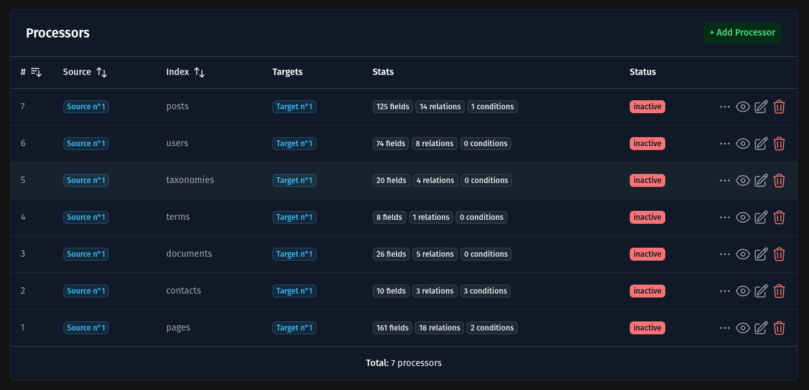
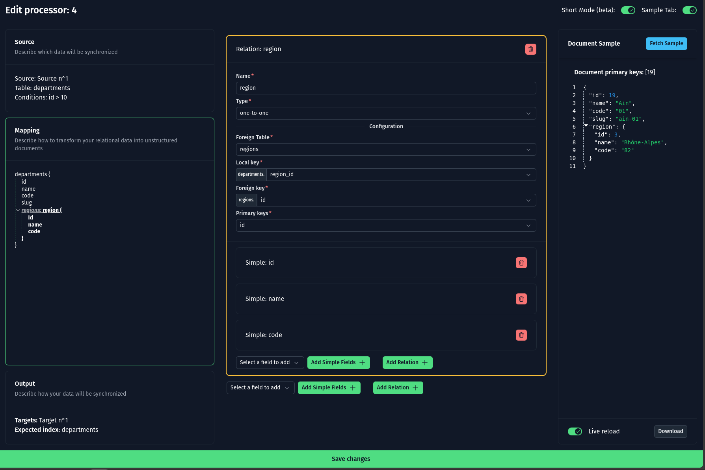

# Thunder

**Thunder** is a lightweight tool designed to effortlessly synchronize your structured SQL databases (Postgres, MySQL,
etc.) with search engine indexes (ElasticSearch, OpenSearch, etc.) without impacting your database's performance.

It’s built for real-time updates and optimized to ensure your data is always indexed and searchable.

## Notes

**This library is currently under active development.**

Features and APIs may change.

Contributions and feedback are welcome!

## Features

- **Non-Intrusive Synchronization**: Sync your SQL data without any performance hit to your database.
- **Real-Time Indexing**: Automatically update indexes in near real-time whenever your data changes.
- **Scalable**: Designed to handle databases of all sizes, ensuring quick and efficient syncs.

## Table of Contents

<!-- TOC -->

* [Notes](#notes)
* [Features](#features)
* [Installation](#installation)
    * [Using go (build from source)](#using-go-build-from-source)
* [How to configure](#how-to-configure)
    * [Sources](#sources)
    * [Processors](#processors)
        * [List processors](#list-processors)
        * [Edit processor](#edit-processor)
    * [Targets](#targets)
* [Contributing](#contributing)
* [Credits](#credits)
* [License](#license)

<!-- TOC -->

## Installation

### Using Docker

- Pull the Docker image from the GitHub Container Registry:
    ```bash
    docker pull ghcr.io/quix-labs/thunder:latest
    ```
- Start container
  ```bash
  docker run -p 3000:3000 -v "./config.json:/config.json"  --name thunder ghcr.io/quix-labs/thunder:latest
  ```

### Using prebuilt assets

You can also install the tool using release assets such as `.deb`, `.apk`, or others.

Download the appropriate package from the [Releases page](https://github.com/quix-labs/thunder/releases), and then
follow the instructions provided for your specific platform.

### Using go (build from source as library)

- Create boilerplate
    ```bash
    cd /path/your/want
    go mod init your_app_name
    go get -u github.com/quix-labs/thunder/app@main
    
    touch main.go # Create base app file
    ```

- Edit `main.go` and put this:
    ```go
    package main
    
    import (
        "github.com/quix-labs/thunder"
        // Remove unnecessary modules/drivers
        _ "github.com/quix-labs/thunder/modules/api"
        _ "github.com/quix-labs/thunder/modules/frontend"
        _ "github.com/quix-labs/thunder/modules/http_server"
        _ "github.com/quix-labs/thunder/source-drivers/postgresql_flash"
        _ "github.com/quix-labs/thunder/target-drivers/elastic"
    )
    
    func main() {
        err := thunder.Start()
        if err != nil {
            panic(err)
        }
    }
    ```

- Compile your app:

    ```bash
    go mod tidy #Download add modules/drivers from main.go
    
    # CGO_ENABLED=0 is optional, but better for cross-platform compilation
    # Ignore it if your are building directly on the target
    
    CGO_ENABLED=0 go build -ldflags="-s -w" -o your_app_name
    ```

- Start your compiled app:
    ```bash
    ./your_app_name
    
    # Actually, the config.json file will be placed in the current directory
    
    # You can now access localhost:3000 and configure
    ```

## How to configure

### Sources

Sources define your database connections

Go to `/sources` to configure them

### Processors

Processor describe how your structured data will be destructured

Go to `/processors` to configure them

#### List processors

<p align="center"></p>

#### Edit processor

* Using the frontend, you can have autocompletion of table and columns

<p align="center"></p>

### Targets

Targets define your indexer connections

Go to `/targets` to configure them

## Realtime compatibility Table

|      Target      | Insert | Insert rel_col | Update | Update rel_col | Delete | Delete rel col | Truncate |
|:----------------:|:------:|:--------------:|:------:|:--------------:|:------:|:--------------:|:--------:|
|    Base table    |  ❌ ◀   |      ❌ ◀       |   ✅    |      ❌ ◀       |   ✅    |       ❌        |    ✅     |
|    one_to_one    |  N/A   |      ❌ ◀       |   ✅    |      ❌ ◀       |   ✅    |       ❌        |    ✅     |
|     has-many     |  ❌ ⏳   |      ❌ ◀       |   ✅    |      ❌ ◀       |   ✅    |       ❌        |    ✅     |
| has-many (pivot) |  ❌ ◀   |      ❌ ◀       |  ❌ ◀   |      ❌ ◀       |   ❌    |       ❌        |    ❌     |

- ◀: `Need to send select request (impact DB)`

## Contributing

1. Fork the repository.
2. Create a new branch for your feature or bugfix.
3. Commit your changes.
4. Push your branch.
5. Create a pull request.

## Credits

- [COLANT Alan](https://github.com/alancolant)
- [All Contributors](../../contributors)

## License

The MIT License (MIT). Please see [License File](LICENSE.md) for more information.