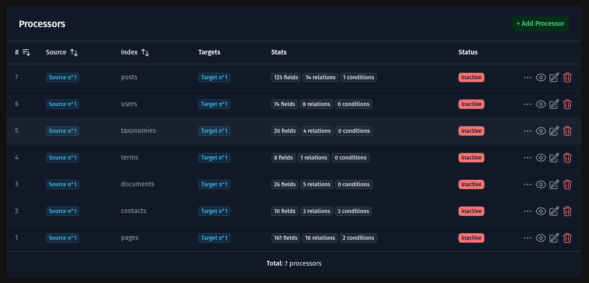
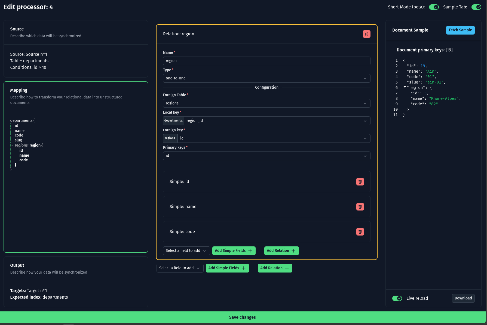

# Processors

In this application, a **processor** serves as the intermediary between a single source and one or more targets.

It bridges the structured SQL data extracted from the source and the unstructured JSON documents required by the target.

## Key Concepts

### 1. Transformation

A processor defines how the structured data from the source is transformed into unstructured JSON documents.

This transformation process includes:

- **Adding Columns**: Introduce new data fields derived from existing data or external calculations.
- **Defining Relationships**: Specify how different tables or datasets in the source relate to one another.
- **Applying Constraints**: Set rules or filters to ensure only relevant data is transformed.

### 2. Flexibility

Processors allow developers to customize the data transformation pipeline, ensuring that the data output aligns with the specific needs of the target.

## Managing Processors via the Web UI

Processor describes how your structured data will be destructured. You can configure them through the **web interface** available at `/processors`.

### List Processors

The list view allows you to see all configured processors in one place.

#### Actions

- **Export**: Generate a file (CSV, JSON, etc.) containing all your data (see [exporters](./exporters)).
- **Claim Index**: Launch a full background indexing of your documents.
- **Start**: Activate real-time mode for the processor. (WIP)
- **Stop**: Deactivate real-time mode. (WIP)

### Add Processor

You can create a new processor by selecting the source and target(s), and view a live example during the configuration process.

### Edit Processor

Using the frontend, you can edit a processor with ease. It features autocompletion for tables and columns, making the configuration process seamless.

## Managing Processors via the API

Refer to the [API documentation for processors](./modules/api/processors.md) for detailed information.